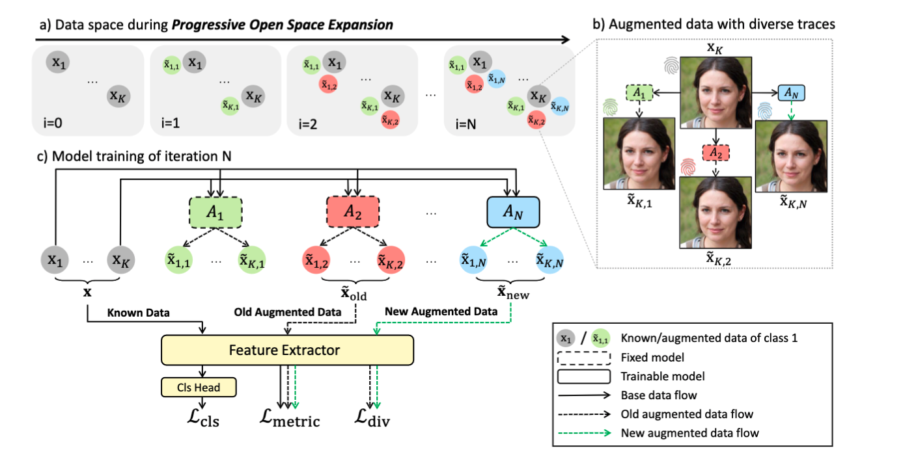

# POSE
### Progressive Open Space Expansion for Open-Set Model Attribution
Tianyun Yang, Danding Wang, Fan Tang, Xinying Zhao, Juan Cao, Sheng Tang, CVPR 2023 

[Paper](https://openaccess.thecvf.com/content/CVPR2023/papers/Yang_Progressive_Open_Space_Expansion_for_Open-Set_Model_Attribution_CVPR_2023_paper.pdf), [Slide](metadata/slide.pdf)

##  Abstract
Despite the remarkable progress in generative technology, the Janus-faced issues of intellectual property protection and malicious content supervision have arisen. Efforts have been paid to manage synthetic images by attributing them to a set of potential source models. However, the closed-set classification setting limits the application in real-world scenarios for handling contents generated by arbitrary models. In this work:
1. We tackle an important challenge for applying model attribution to open scenarios, the **Open-Set Model Attribution (OSMA)** problem, which attributes images to known models and identifies images from unknown ones.<br>
2. We propose a novel **Progressive Open Space Expansion (POSE)** solution, which simulates the potential open space of unknown models progressively by a set of lightweight augmentation models, and consequently reduces open space risk.<br>
3. We construct an OSMA benchmark simulating the real-world scenarios, on which extensive experiments prove the superiority of POSE compared with existing GAN attribution methods and off-the-shelf OSR methods. 

## Prerequisites
- Linux
- NVIDIA GPU + CUDA 11.1
- Python 3.7.13
- pytorch 1.10.0

## Dataset
The whole dataset in this work will be released soon. Download, unzip, and put the dataset into the directory ``./dataset/``.
As the size of the whole dataset is up to 50GB. 

We provide a small subset of the datset in [DatasetSubset](https://drive.google.com/file/d/1gZ-pCXE8_CSUr3pLLORtVBQRuX0ATv46/view?usp=drive_link). You can use this for the evaluation and visualization demos below. Also, download and put the subset into the directory ``./dataset/``.

The annotation files are in ``./dataset`` and could be downloaded along with the project. The organization is as follows: 
  ```
  dataset
  ├── $split{id}_test
  │   └── annotations
  │       ├── $split{id}_test.txt
  │       ├── $split{id}_test_out.txt
  │       ├── $split{id}_test_out_seed.txt
  │       ├── $split{id}_test_out_arch.txt
  │       └── $split{id}_test_out_dataset.txt
  ├── $split{id}_train
  │   └── annotations
  │       └── $split{id}_train.txt
  └── $split{id}_val
      └── annotations
          └── $split{id}_val.txt
  ```
where `split{id}_train.txt, split{id}_val.txt, split{id}_test.txt` are the annotation files for training, validation, closed-set testing. `split{id}_test_out.txt` is the annotation file for all open-set/unknown data. `split{id}_test_out_seed.txt, split{id}_test_out_arch.txt, split{id}_test_out_dataset.txt` are annotation files for unseen seed, unseen architecture, and unseen dataset respectively. 


## Training
  - Run the following script:
  ```
  sh ./script/run_train.sh
  ```
  - Following is a training script example for split1: 
  ```
  python3 main.py --config_name progressive --mode POSE --device cuda:0 --data split1
  ```

## Checkpoints 
  - We provide checkpoints trained on five splits of the dataset in [Checkpoints](https://drive.google.com/drive/folders/1h_-U9VhgeCWJKWfobPhd64u4YCS47-Br?usp=drive_link). Download and put files into the directory ``./checkpoints``.
Each file ``split#/model.pth`` corresponds to the weight trained on ``split#``. The directory also includes augmentation models and model weights for split1 and split2 during the progressive training progress.

## Demo
- [Demo1](evaluation_demo.ipynb) for open-set evaluation, including metric calculation, confidence histogram, ROC curve, and detailed results for each unknown class.

- [Demo2](case_visualization.ipynb) for t-SNE visualization of known, unknown, and augmented data. (Fig.4 in our paper)

- [Demo3](prog_visualization.ipynb) for t-SNE visualization of the progressive open space expansion process. (Fig.5 in our paper)

## Testing

  - For result reproduction, you may download the whole dataset and run following:
    ```
    sh ./script/run_test.sh
    ```
  - Following is a testing script example for split1: 
    ```
    python3 test.py --model_path ./checkpoints/split1/model.pth --device cuda:0 -data split1
    ```

## Acknowledgement
We sincerely appreciate the following respositories where generative models in our dataset are mainly from:

https://github.com/ningyu1991/GANFingerprints<br>
https://github.com/TuBui/image_attribution<br>
https://github.com/kwotsin/mimicry<br>
https://github.com/yunjey/stargan<br>
https://github.com/LynnHo/AttGAN-Tensorflow<br>
https://github.com/tkarras/progressive_growing_of_gans<br>
https://github.com/NVlabs/stylegan<br>
https://github.com/NVlabs/stylegan2<br>
https://github.com/NVlabs/stylegan3<br>
https://github.com/POSTECH-CVLab/PyTorch-StudioGAN<br>
https://github.com/ondyari/FaceForensics<br>
https://github.com/Rudrabha/Wav2Lip<br>
https://github.com/YuvalNirkin/fsgan<br>
https://github.com/richarduuz/Research_Project/tree/master/ModelC<br>


