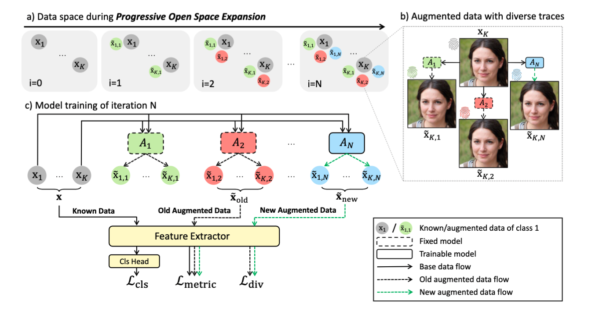

# POSE
### Progressive Open Space Expansion for Open-Set Model Attribution
Tianyun Yang, Danding Wang, Fan Tang, Xinying Zhao, Juan Cao, Sheng Tang 
CVPR 2023 

##  Abstract
Despite the remarkable progress in generative technology, the Janus-faced issues of intellectual property protection and malicious content supervision have arisen. Efforts have been paid to manage synthetic images by attributing them to a set of potential source models. However, the closed-set classification setting limits the application in real-world scenarios for handling contents generated by arbitrary models. In this work:
1. We tackle an important challenge for applying model attribution to open scenarios, the **Open-Set Model Attribution (OSMA)** problem, which attributes images to known models and identifies images from unknown ones. 
2. We propose a novel **Progressive Open Space Expansion (POSE)** solution, which simulates the potential open space of unknown models progressively by a set of lightweight augmentation models, and consequently reduces open space risk. 
3. We construct an OSMA benchmark simulating the real-world scenarios, on which extensive experiments prove the superiority of POSE compared with existing GAN attribution methods and off-the-shelf OSR methods. 

